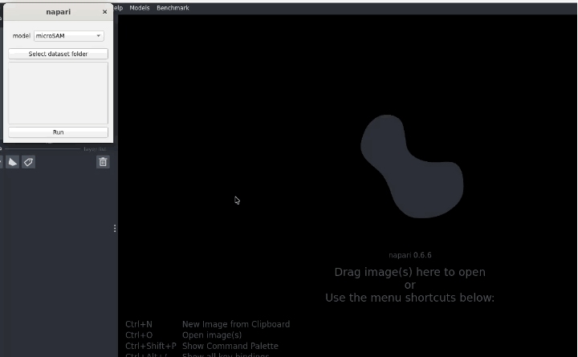

# Using AdaptFM to Fine-Tune Models

AdaptFM supports GUI-based fine-tuning for various models. First, make sure you have [installed the tool](../../README.md/#Installation)

Steps:
1. Select the "Models" --> "Training" at the top of Napari
2. Use the 'model' dropdown to select the model you would like to train
3. Enter the function used for training to pull in hyper parameters. They are:
   - CellposeSAM - train_seg
   - MicroSAM - train_sam
   - SSVT - train_SSVT
   - SAM-Med-3D - launch_training
5. Adjust parameters as needed
6. "Select dataset folder" --> folder with raw images and associated masks used for training.
7. When you hit "Run" you will be prompted to select an output directory for your results, and a GPU to use.

