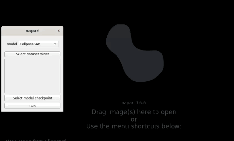

# Using AdaptFM to Test Models

AdaptFM support GUI-based inference for various models. First, make sure you have [installed the tool](../../README.md/#Installation)

All inference pipelines follow the same steps:
1. Select the "Models" --> "Inference" at the top of Napari
2. Use the 'model' dropdown to select the model you would like to test
3. "Select dataset folder" --> raw images you would liket to predict using the model
4. "Select model checkpoint" --> you can optionally select the checkpoint for a trained model. This is not required for MicroSAM, CellposeSAM, or SAM-Med-3D. It is required for nnUNetv2.
5. When you hit "Run" you will be prompted to select an output directory for your results, and a GPU to use.

If you have already tested a model, you can benchmark it against a ground truth following the [steps here](./Benchmarking-Models.md). 

Demo:

