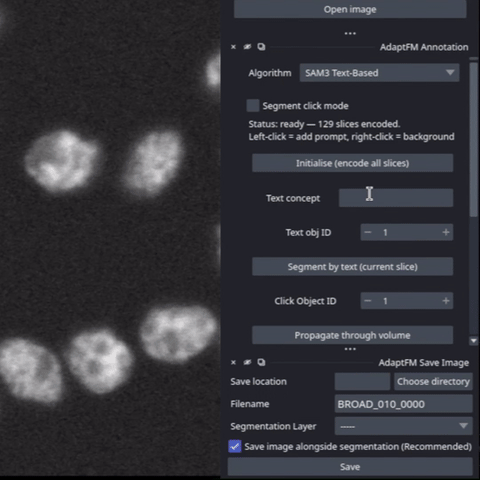
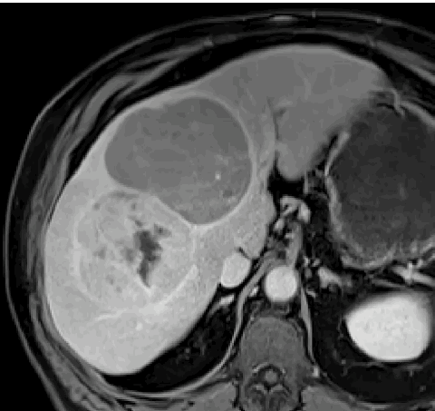

# AdaptFM

An interactive framework for annotating, training, running inference, and benchmarking 3D segmentation models. 

In AdaptFM you can:
- Test and benchmark 3D segmentation models on your data. We currently support CellposeSAM, MicroSAM, nnUNetv2, SAM-Med-3D, and SSVT.
- Create 3D annotations using a number of segmentation algorithms, including SAM2 for click-based segmentation and SAM3 for text-based segmentation
- Use those annotations to fine-tune/train models on your data
- Add new models or annotation algorithms

***Model Versions***

The installation scripts for CellposeSAM, MicroSAM, SAM2, SAM3, SAM-Med3D, and nnU-Net have been tested with the specific commit [hashes/versions](#Versions/Hashes). These upstream tools change frequently, so we track and update compatibility as needed.

If you find a newer version that works (or breaks), please open an Issue so we can update the installer

[Installation](#main-installation) | [Get Started](docs/Standard) | [Customizing (Advanced Users)](docs/Customizations/customizations-main.md) | [Try the Demo](docs/Testing_AdaptFM.md)

 

## <a id="main-installation"></a>Installation

***AdaptFM has only been tested on Ubuntu 22.04.5 LTS***

Clone the repo and install required dependencies

```bash
conda create --name AdaptFM python=3.12 -y
conda activate AdaptFM
git clone https://github.com/Zhao-Lab-UW-DHO/AdaptFM.git
cd AdaptFM
pip install -e .
```
Then, since PyTorch must be installed based on the Compute Platform of your own system: find [on the PyTorch local installation helper](https://pytorch.org/get-started/locally/) the `pip3 install` command with Linux, Pip, Python, and the Compute Platform of your GPU (typically found by looking at the CUDA Version of `nvidia-smi`) selected. Copy and paste the PyTorch `pip3 install` command when prompted from running:  
```bash
adaptfm-set-pytorch
``` 
This will install PyTorch into AdaptFM as well as save the hardware specific install for use in automatic [installation of External Models](#external-model-install).

> [!TIP]
> Support for using [SAM2](https://github.com/facebookresearch/sam2) and [SAM3](https://github.com/facebookresearch/sam3) are optional additions to the AdaptFM environment since these tools have specific system requirements. SAM2 and SAM3 can be installed with below commands. SAM3 comes with additional steps: **To use SAM3 you must request access to their checkpoints through [hugging face](https://huggingface.co/facebook/sam3) (download [here](https://huggingface.co/facebook/sam3/resolve/main/sam3.pt?download=true)) and place the file sam3.pt into** `<AdaptFM-Install-Location>/AdaptFM/AdaptFM/segmentation/sam3/checkpoint/sam3.pt`. AdaptFM will still work if you do not install SAM2 or SAM3.
> > We have found in testing that SAM3 will not work with the PyTorch Compute Platform CUDA 12.6

```bash
adaptfm-install-sam2
adaptfm-install-sam3
```

**Note that SAM3 has an [issue](https://github.com/facebookresearch/sam3/issues/193) with box prompts. There is a proposed workaround, but we are still waiting for a durable solution**

### <a id="launching"></a>Launch after install 
> [!WARNING]
> AdaptFM **must** be launched from inside the main AdaptFM folder (the folder containing the `LICENSE` file).

With the AdaptFM conda environment activated use 
```bash
python -m AdaptFM.dev_launch
``` 
to run AdaptFM.

### <a id="external-model-install"></a> Using Supported External Models with AdaptFM

AdaptFM supports a variety of external models. These are optional; you only need to install the models you plan to use. AdaptFM provides a series of automatic install commands to create the conda environments with the necessary packages and expected environment names to run your choice of external model:

[MicroSAM](https://github.com/computational-cell-analytics/micro-sam) 
```bash
adaptfm-install-microsam
```
[CellposeSAM](https://github.com/mouseland/cellpose)
```bash
adaptfm-install-cellposesam
```
[nnUNet](https://github.com/MIC-DKFZ/nnUNet/tree/master)
```bash
adaptfm-install-nnunet
```
Note that nnUNet is currently experiencing [a bug](https://github.com/MIC-DKFZ/nnUNet/issues/3009) that will prevent users from training.  

[SAM-Med3D](https://github.com/uni-medical/sam-med3d)
```bash
adaptfm-install-sammed3d
```
The installation of SAM-Med3D will prompt you for the location of the AdaptFM and SAM-Med3D folders
You will also need to download the [model checkpoint](https://github.com/uni-medical/sam-med3d#-checkpoint)
 
### Testing AdaptFM

We have provided some test data for AdaptFM on [hugging face](https://huggingface.co/datasets/hbakhtiar/AdaptFM_Testing/tree/main). Descriptions of each dataset are in the hugging face 'README' file. You can download datasets by using the below code-block. Update 'local_dir' to the location you want to download the data (write the folder location in quotes). 

Use 'allow_patterns' to specify the dataset you want to download. The folder name should have /* at the end to download all contents in the folder. The folder name should be in quotes as below.  

You can download the entire dataset at once by removing the 'allow_patterns' line completely. **However, note that the repo is over 100GB so ensure you have enough space before downloading**

You can then test AdaptFM using this [demo script](https://github.com/Zhao-Lab-UW-DHO/AdaptFM/blob/AdaptFM/docs/Testing_AdaptFM.md)

```bash
conda activate AdaptFM
pip install huggingface_hub

python -c "
from huggingface_hub import snapshot_download
snapshot_download(
    repo_id='hbakhtiar/AdaptFM_Testing',
    repo_type='dataset',
    allow_patterns='BBBC024/*', #Replace with desired folder
    local_dir='' #add where you want the download to go
)
"
```

### Using SSVT

SSVT is a model pretrained on roughly 180,000 organoid images. The checkpoint is publicly available for download on [hugging face](https://huggingface.co/hbakhtiar/SSVT_Organoids/tree/main). SSVT is supported directly within AdaptFM. You can copy and paste the below code block to download the model. Change the local_dir to the download location for the model (keep quotes).

```bash
conda activate AdaptFM
pip install huggingface_hub

python -c "
from huggingface_hub import snapshot_download
snapshot_download(
    repo_id='hbakhtiar/SSVT_Organoids',
    repo_type='model',
    allow_patterns='SSVT.pth',  # Only download the checkpoint
    local_dir=''  # Add destination folder
)
"
```

Once downloaded you can follow our [fine-tuning instructions](docs/Standard/Fine-tuning-models.md) to build a model for a specific downstream segmentation task. 

### Versions/Hashes

CellposeSAM Version 3.1
MicroSAM Version 1.7.6
nnUNet Version 2.7.0

