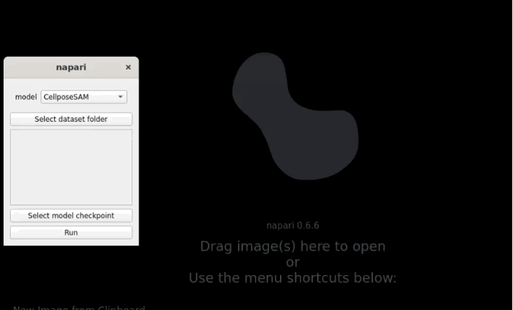

# Using AdaptFM to Test Models

AdaptFM supports GUI-based inference for various models. First, make sure you have [installed the tool](../../README.md/#main-installation).

All inference pipelines follow the same steps:
1. Select the "Models" --> "Inference" at the top of Napari.
1. Use the 'model' dropdown to select the model you would like to test.
1. "Select dataset folder" --> raw images you would like to predict using the model.
    - The images in the dataset folder must be in a format supported by the model which is .tiff for all models except SAMMed-3D which uses .nii.gz
1. "Select model checkpoint" --> these are the weights of the trained model to test
    - This is an optional input for MicroSAM, and CellposeSAM as their downloaded checkpoints will be automatically read and used. 
    - This is a required input for SAM-Med3D, nnUNetv2 and SSVT.
1. When you hit "Run" you will be prompted to select an output directory for your results, and a GPU to use.

If you have already tested a model, you can benchmark it against a ground truth following the [steps here](./Benchmarking-Models.md). 

Demo:

