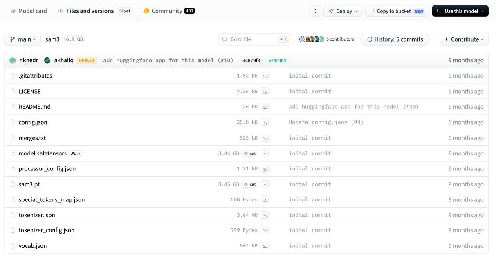

# Segment Anything 3 (SAM3)

Segment Anything Model 3 (SAM3) is a foundation model developed by [Facebook research](https://github.com/facebookresearch/sam3) used for identifying objects in images and videos by using text concepts and click prompts. Users can segment objects by entering a text-concept (e.g. football) then further refine segmentations by clicking objects, similar to [Segment Anything 2](./sam2.md)


***In order to use you must download the model using [this link](https://huggingface.co/facebook/sam3/tree/main).***



***Once downloaded move the files to the checkpoint folder within the SAM3 repo under AdaptFM > Segmentation > sam3.***

***SAM3 allows users to segment objects in a 2D image slice by entering text concepts or clicking on objects of interest. For 3D images, AdaptFM can either propagate that segmentation through the z-axis by treating the slices like frames in a video (using SAM3's video propagation capability), or independently segment every 2D slice.***

## How It Works

1. **Encode image** - this runs the image through the SAM2 model. This will not segment the image directly. It simply 'preps' the image so when a user enters a text concept objects will be segmented
2. **Enter a text concept** - users can enter a text-concept, (e.g. 'cells') and allow the algorithm to find those objects in the current 2D slice of the image. 
3. **Click objects to segment** - once the text concept has been entered and segmented objects, users can additionally segment objects by clicking on them
4. **Extend the segmentation through the volume (optional)** - Because a 3D image consists of a series of 2D slices, users can choose to propagate the segmentation across neighboring z-layers. SAM3 treats each z-layer as a separate 'frame' and tracks the selected object as it changes from slice to slice.  
5. **Review and refine** - The resulting segmentation can be reviewed and modified by the user as needed.

## Parameters

Within AdaptFM there are several adjustable parameters when using SAM3: 

1. **Segment click mode** - when checked, clicking on the image will segment objects. Be sure to uncheck if clicking on the image for other reasons. 
2. **Initialize (encode all slices)** - this will run the image through the SAM3 model. Once the image is encoded you can start segmenting objects in the image. 
3. **Text concept** - the text concept a user wants to identify in the image (for example, 'cells', 'nucleus', 'cell membrane')
4. **Text Obj ID** - the label ID that will be assigned to the objects found by 'Text Concept'
5. **Segment by text (current slice)** - once a user has typed a text concept in the "Text concept" field, they can press this button to generate segmentations
6. **Click Object ID** - the ID of the current object to be segmented via clicking
7. **Propagate through volume** - once a user is done segmenting objects in a 2D slice, they can select this to extend the segmentation through the volume. This works in coordination with 'propagation_direction' to extend the segmentation 'forward' (higher z layers), 'backward' (lower z layers), or in both directions.
8. **Reset current object** - Allows users to remove the segmentation with the ID currently in "Click Object ID"
9. **Reset all** - Allows users to remove all segmentations from the image (across all layers)
10. **propgation_direction** - used with "Propagate through volume". 
    - Both - the segmentation will be extended across z layers in both directions
    - Forward - the segmentation will be extended across higher z layers
    - Backward - the segmentation will only be extended across lower z layers
11. **score_threshold** - how confident the model should be that a pixel is part of an object. Ranges from 0 to 1.0, with a default of 0.5 
    - Higher score_threshold - only pixels the model is very confident are part of the object will be included in the segmentation. Setting this too high might cause the model to miss pixels. 
    - Lower score_threshold - the model will include less confident pixels as part of the object. Setting this too low might cause the model to include too many pixels in the object. 
12. **text_conf_threshold** - how confident the model should be that a pixel is part of an object and matches the text concept. Ranges from 0 to 1 with a default of 0.25
    - Higher text_conf_threshold - only pixels the model is very confident match the text concept will be segmented. Setting this too high might cause the model to miss pixels
    - Lower text_conf_threshold - the model will include more pixels even if they match the text concept with less confidence. Setting this too low might cause the model to include too many pixels in the object.
11. **GPU** - The GPU you plan to run processing on

## Box Prompts with SAM3

There is currently an [issue](https://github.com/facebookresearch/sam3/issues/193) with box prompts in SAM3. While there is a proposed workaround, **this has not been validated/approved by the SAM3 authors**. Consequently, we have left this out of AdaptFM so as to avoid conflicts with future SAM3 releases. The proposed workaround is below.

In AdaptFM > segmentation > Seg_Alg.py in the SAM3TextAndPropagate class, change _load_predictor to 

```python

    def _load_predictor(self) -> None:

        import sys
        # print(sys.path)
        if self._predictor is not None:
            return

        try:
            from sam3.model_builder import build_sam3_video_predictor
        except ImportError as e:
            raise ImportError(
                "SAM3 is not installed. "
                "Clone https://github.com/facebookresearch/sam3 and run `pip install -e .`"
            ) from e

        try:
            ckpt_dir  = Path(os.environ["SAM3_CHECKPOINT_DIR"])
            assert ckpt_dir.exists(), f"{ckpt_dir} does not exist!"
            # (in future) SAM3 loads checkpoints via HuggingFace by default; pass the dir so it
            # can find a locally cached copy, or leave empty to trigger HF download.
            ckpt_path = next(ckpt_dir.glob('*.pt'))
        except Exception as e:
            print(e)

        self._predictor  = build_sam3_video_predictor(
           checkpoint_path=ckpt_path,
            gpus_to_use=[self.gpu]
        )

        self._predictor.model.hotstart_delay=0 # --> THIS LINE IS NEW
```


