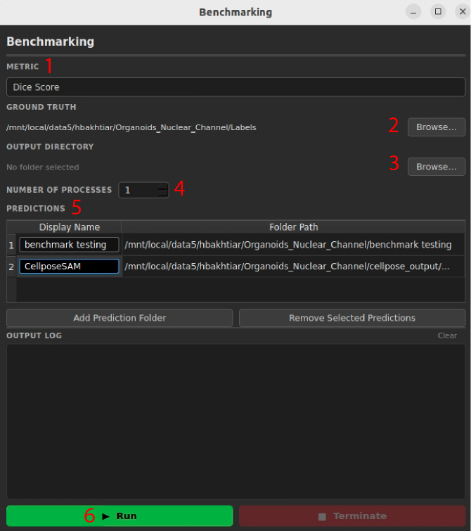

# Benchmarking Models Using AdaptFM

You can use AdaptFM's benchmarking module to compare model performance on segmentation tasks. To benchmark models navigate to 'Benchmark' > 'Run Benchmark' at the top of AdaptFM. The steps to benchmarking models are:

1. Select the metric you would like to use for benchmarking. The available options are
    - **Dice score** - how well do the segmentations overlap with the ground truth data
    - **Mean Object F1** - for each object, how well did the segmentation overlap with the ground truth data
    - **Panoptic F1** - how well the algorithm finds the same objects as the ground truth - counting a match only when a predicted object overlaps a real one enough (over 50%)
    - **Boundary F1** - how well your predicted objects edges line up with the real object edges - counting matching boundary pixels and turning that precision/recall into one score
    - **Compare Counts** - how well does your algorithm enumerate the same total number of objects as the ground truth

2. Under "Ground Truth" select the folder with your ground truth images. These should be names **identically** to your model predictions. 
    - If performing counts comparison, you should first create a `.csv` file with two columns:
        1. File names that identically match the names of your predicted images
        2. Counts with the ground-truth object counts. See Organoids_Nuclear_Channel's ground-truth CSV as an example [link](https://huggingface.co/datasets/hbakhtiar/AdaptFM_Testing/tree/main)

3. Under 'Output Directory' select the folder where you would like to save the generated plots from running benchmarking

4. Change the 'Number of Processes' field based on how quickly you want to run the algorithm. Note that increasing the number will run the algorithm faster, but will also use more compute resources. We recommend starting small and slowly increasing so you can understand how it might impact other users. 

5. In the "Predictions" box you can add folders with segmented images you would like to benchmark by using the "Add Prediction Folder" button. You can add multiple sets of predictions at once. A couple of fields to keep track of 
    - **Display Name** - this is the name for the folder that will appear in your final plot. You can change this field as needed
    - **Folder Path** - This is the folder path to the images you would like to benchmark
    - **Remove Selected Predictions** - If you added a set of predictions you would no longer like to benchmark, select the predictions and click "Remove Selected Predictions" to remove the predictions. 

6. Once you have set all of your predictions, you can click "Run" to begin benchmarking. You can monitor the output within the "Output Log" while continuing to work in AdaptFM. 

Example benchmark plots for [counts comparison](../../asset/Compare_counts_example.jpg) and [box plots](../../asset/Example_Dice_Boxplot.jpg)
