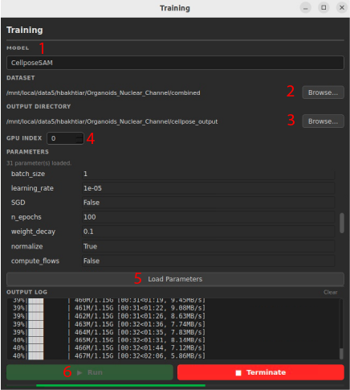

# AdaptFM Training Module

AdaptFM supports GUI-based fine-tuning/training for various models. The following models allow for fine-tunining and are supported within AdaptFM

[CellposeSAM](../using-segmentation-models/cellposesam.md) - a deep learning model designed to identify and segment cell and other biological structures in microscopy.

[MicroSAM](../using-segmentation-models/microsam.md) - a deep learning model designed to segment objects in microscopy images

[SSVT](../using-segmentation-models/ssvt.md) - a custom vision transformer model pretrained on ~180,000 3D organoid confocal microscopy images.

[BME-X](../using-segmentation-models/bmex.md) - a foundation model designed for magnetic resonance images (MRI). Has a segmentation model for MRI Brains.

[nnUNetV2](../using-segmentation-models/nnunetv2.md) - a machine-learning framework designed to learn how to identify and segment structures in medical and biological images.

[SAM-Med3D](../using-segmentation-models/sammed3d.md) - a deep learning model designed to segment objects in 3D medical images (e.g. CT)

[CTFM](../using-segmentation-models/ctfm.md) - a 3D image-based pre-trained foundation model for a number of radiological segmentation tasks

**Follow the instructions in the above links to launch training for each model.** All models follow the same general steps. Being by selecting the "Segmentation Models" --> "Training" at the top of AdaptFM:

1. Use the 'Model' dropdown to select the model you would like to train or fine-tune.
2. Under 'Dataset' choose the folder you saved files to while making [annotations](annotations.md). If you made annotations outside of AdaptFM ensure
      - All images (original and annotations) are placed together in one folder
      - All images are in the proper format for the specified model (see the above links)
      - Annotations file names end with '_seg.tiff'
3. Under 'Output Directory' choose the folder where you would like to save your training progress/data. 
4. Use the 'GPU Index' field to choose which GPU you would like to use. If your system has only one GPU this will be chosen automatically
5. If available, select "Load Parameters" to see the model's hyperparameters. For detailed descriptions of the most common parameters, use the above link to see descriptions of the model's parameters.
6. Click "Run" to launch training. You can continue to monitor progress in the output log. 

