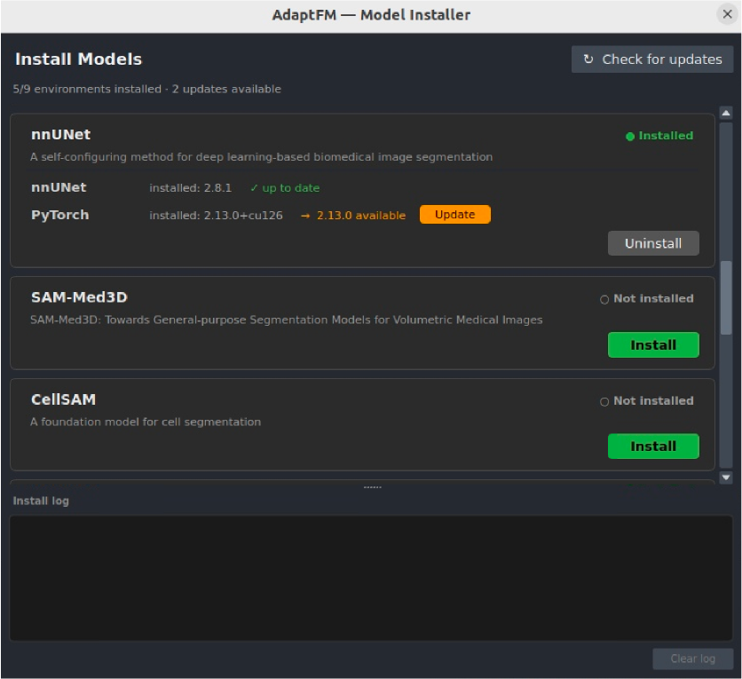

# AdaptFM Model Installer

AdaptFM supports a number of external models to perform annotation, fine-tuning, and inference. Users can install and uninstall these models within AdaptFM's Model Installer. The installer will additionally probe models for version updates, so that as models are updated, you can upgrade your version to stay up-to-date with the latest releases. 

***After installing a model or set of models you must restart AdaptFM before they will be usable*** 

Note that for all models except for SSVT, SAM2, and SAM3, a separate Conda environment will be created. Due to the size of the models and packages, we recommend only downloading the models you intend to use. The available models are:

[Segment Anything 2](../annotating/sam2.md) 

[Segment Anything 3](../annotating/sam3.md) 

[SSVT](../using-segmentation-models/ssvt.md)

[BME-X](../using-segmentation-models/bmex.md)

[CellposeSAM](../using-segmentation-models/cellposesam.md)

[MicroSAM](../using-segmentation-models/microsam.md)

[CellSAM](../using-segmentation-models/cellsam.md)

[CTFM](../using-segmentation-models/ctfm.md)

[Merlin nnUNet](../using-segmentation-models/merlin-nnunet.md)

[nnUNetV2](../using-segmentation-models/nnunetv2.md)

[SAM-Med3D](../using-segmentation-models/sammed3d.md)

To install models using the model installer, navigate to "Model Installer" > "Install Models..." at the top of AdaptFM. The installer will take a moment to scan for models and whether or not updates are available. You can then install, uninstall, or update models using the associated button. As the model is installing/uninstalling you can monitor progress in the Install Log

