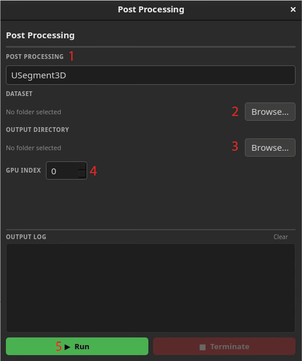

# AdaptFM Postprocessing Module 

You can use AdaptFM to run postprocessing algorithms on previously generated segmentations. The postprocessing module has 5 main parts:

1. **Pipeline:** The postprocessing algorithm or pipeline you would like to apply to your dataset.
2. **Dataset:** The dataset or folder containing the segmented images or model probability outputs you would like to process.
3. **Output Directory:** The folder where you would like to save your postprocessed results.
4. **GPU Index:** Choose which GPU to assign for acceleration (if applicable).
5. **The Run Button:** Use the run button to launch postprocessing. Monitor pipeline progress in real-time in the output log above.

AdaptFM's postprocessing algorithms are described in detail [in our documentation](../postprocessing/postprocessing_descriptions.md).