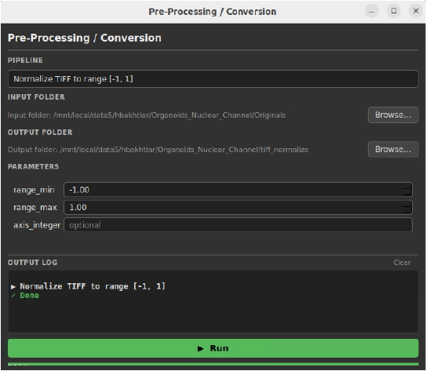

# AdaptFM Preprocessing Module 

You can use AdaptFM to run preprocessing algorithms and file conversions on images. The preprocessing module has 5 main parts:

1. **Pipeline:** The preprocessing pipeline you would like to apply to your data. 
2. **Input Folder:** The folder containing images you would like to run preprocessing on.
3. **Output Folder:** Where you would like to save your processed images
4. **Parameters:** Any adjustable parameters for the pipeline. Note that only some pipelines will have associated parameters.
5. **Output Log:** Monitor progress of the pipeline in realtime in the output log. 

The AdaptFM preprocessing module currently supports 4 preprocessing algorithms:

1. **ND2 to TIFF Converter**: This algorithm allows users to convert 3D ND2 images to a TIFF file. Many confocal microscopy images are stored as TIFF, while many foundation models require TIFF or other format. 

2. **Normalize TIFF to Range**: This algorithm allows users to normalize their TIFF files to a specified range. **Note that all normalization and preprocessing pipelines are performed by the foundation models. You do not need to run normalization on your data prior. We recommend using only the normalization and preprocessing scheme used in the model.** 
    - range_min: the new smallest value in your image after normalization
    - range_max: the new largest value in your image after normalization
    - axis_integer: Specify the axis (z,y,x) you would like to normalize. Possible values are
        - 1: z axis
        - 2: y axis
        - 3: x axis
        - None: whole volume

3. **conv_to_uint8:** This algorithm wil convert the input directory to a uint8 format by rescaling the values to a range of [0,255]. 

4. **conv_to_bmask:** This algorithm will convert a segmentation mask into a binary mask with values 0 and 1. The input should be uint8. This will convert segmentation labels that are typically read as image layers in Napari to labels layers. 

