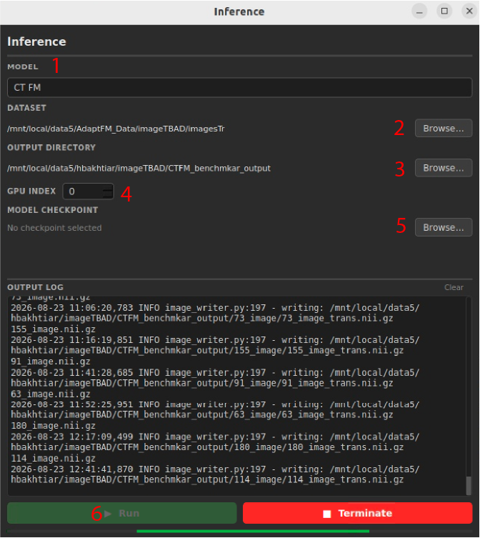

# Using AdaptFM to Test Models

AdaptFM supports GUI-based inference for 9 segmentation models. The supported models are:

[CellposeSAM](../using-segmentation-models/cellposesam.md) - a deep learning model designed to identify and segment cell and other biological structures in microscopy.

[MicroSAM](../using-segmentation-models/microsam.md) - a deep learning model designed to segment objects in microscopy images

[SSVT](../using-segmentation-models/ssvt.md) - a custom vision transformer model pretrained on ~180,000 3D organoid confocal microscopy images.

[BME-X](../using-segmentation-models/bmex.md) - a foundation model designed for magnetic resonance images (MRI). Has a segmentation model for MRI Brains.

[nnUNetV2](../using-segmentation-models/nnunetv2.md) - a machine-learning framework designed to learn how to identify and segment structures in medical and biological images.

[SAM-Med3D](../using-segmentation-models/sammed3d.md) - a deep learning model designed to segment objects in 3D medical images (e.g. CT)

[CTFM](../using-segmentation-models/ctfm.md) - a 3D image-based pretrained foundation model for a number of radiological segmentation tasks

[Merlin nnUNet](../using-segmentation-models/merlin-nnunet.md) - a 3D CT segmentation model that is fine-tuned from the [Merlin](https://github.com/StanfordMIMI/Merlin) foundation model.

[CellSAM](../using-segmentation-models/cellsam.md) - is a pretrained foundation model designed to automatically identify and segment cells and other cellular structures in microscopy images.

**Follow instructions in the above links to launch inference for different models.** Model inference follows the same general steps. Begin by selecting "Segmentation Models" –> "Inference" in the top of AdaptFM.

1. Use the 'Model' dropdown to select the model you would like to test.
2. Under 'Dataset' choose the raw images you would like to predict using the model. Again, use the above links to ensure your images are in the correct format for the model.   
3. Under 'Output Directory' choose the folder where you would like to save your segmented results.
4. Use the 'GPU Index' field to choose which GPU you would like to use. If your system has only one GPU this will be chosen automatically
5. Under 'Model Checkpoint' you can **optionally** select a model checkpoint. Most models will automatically select a checkpoint. 
6. Click 'Run' to launch predicting. You can continue to monitor progress in the output log. 

