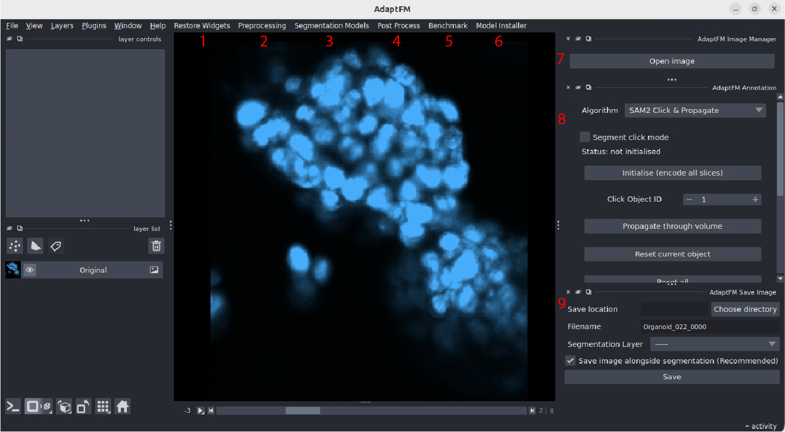

# AdaptFM User Guide

AdaptFM is a Napari-based imaging platform for viewing, annotating, training, benchmarking, and deploying foundation-model segmentation workflows across 3D biological data. AdaptFM unifies image viewing, semi-automated annotation using tools like SAM2 and SAM3, segmentation foundation-model training and inference (supporting 9 models for inference, 7 for fine-tuning), image preprocessing (e.g. format conversion, image normalization), postprocessing, and benchmarking. Users can install all models directly from AdaptFM. Importantly, every module in AdaptFM - preprocessing, annotation, postprocessing, training, inference, and benchmarking is customizable, enabling seamless integration of new algorithms and foundation models as they emerge. 

AdaptFM has 9 distinct modules highlighted below. Click the links for each to learn more about how to use each module.

1. **AdaptFM Restore Widgets:** - if one of the side widgets (AdaptFM Image Manager, Annotation Manager, or Save Image Manager) is closed, use this menu to reopen it.

2. [**AdaptFM Preprocessing Module:**](preprocessing.md) This widgets lets users optionally run various preprocessing algorithms or file conversions on image data. 

3. **AdaptFM Segmentation Models Module:** This module has two main parts:
    - [Fine-tuning Segmentation Models](fine-tuning-models.md): Use this to fine-tune an existing foundation model on your data
    - [Running Inference with Segmentation Models](testing-models.md): Use this to test various models on your data

4. [**AdaptFM Postprocessing Module:**](postprocessing.md) This module lets users run various postprocessing algorithms on images after segmentation. These are algorithms primarily designed for segmented images.

5. [**AdaptFM Benchmarking Module:**](benchmarking-models.md) This module lets users objectively compare models' performance against each other and a predefined ground truth.

6. [**AdaptFM Model Installer:**](model-installer.md) This module lets you download and install different foundation models to use within AdaptFM. You can also use this module to check for updates to your downloaded models. 

7. **AdaptFM Image Manager:** To open an image in AdaptFM you can use the "Open Image" button in the top right corner. AdaptFM also supports Napari's native File > Open File workflow for opening images. You can also open images in AdaptFM by using Napari's built-in "Drag and Drop" functionality.
>We recommend the usage of "Open Image" as Napari's native image loader does not handle the `.nii.gz` extension.

8. [**AdaptFM Annotation Manager:**](annotations.md) This widget lets users run different segmentation algorithms on images. This is designed to help users quickly create training data and/or ground truth benchmarking data. To run segmentation foundation model training/inference use the Segmentation Models module. 

9. [**AdaptFM Save Widget:**](annotations.md#adaptfm-save-widget). After creating annotations, save labeled images using the AdaptFM save widget. This saves images in the format needed to launch training
>AdaptFM is not a plugin within Napari, it is built as a standalone application on the Napari viewer. It adds all the above menus and widgets as part of the starting up. 

# Customizing AdaptFM

AdaptFM is explicitly designed to accommodate new annotation algorithms, segmentation models, pre/postprocessing pipelines, and benchmarks. To learn more about how to add your own algorithms to AdaptFM visit our [customizing AdaptFM](../customizing-adaptfm/index.md) page.

If you would like to add your contribution to our repository, please visit our [contributing](../customizing-adaptfm/contributing.md) page. 

### Model Leaderboard

To see how models have performed on some of our internal datasets, check out our [leaderboard](leaderboard.md)